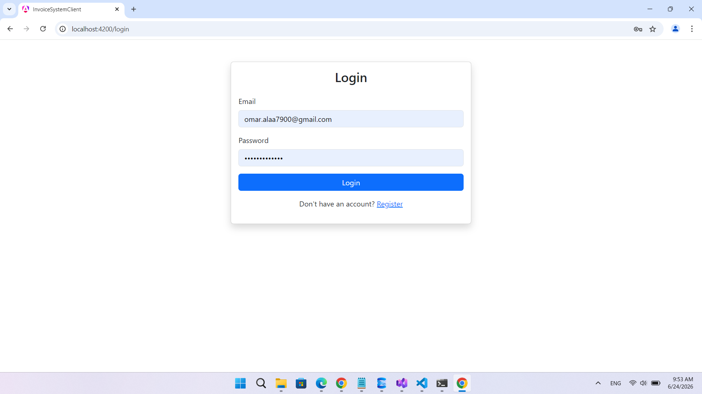
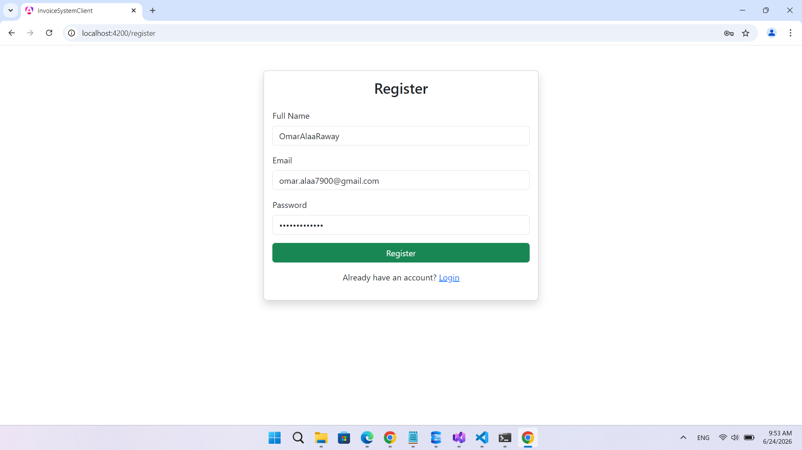
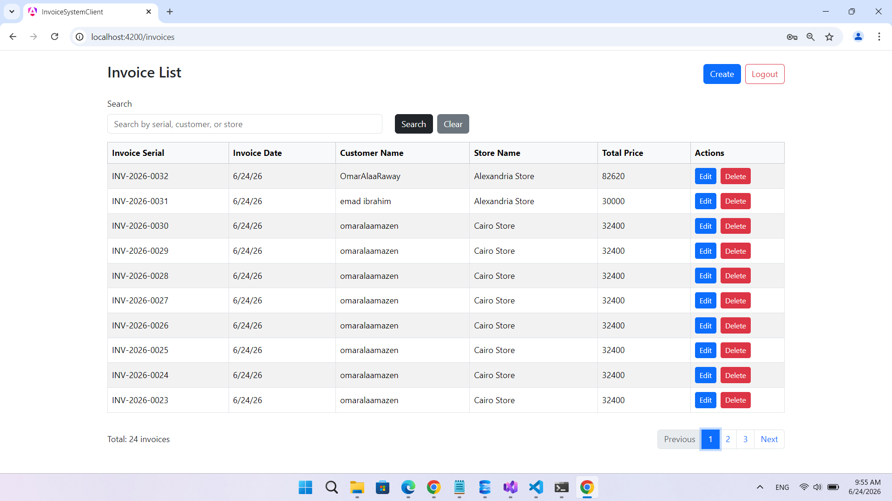
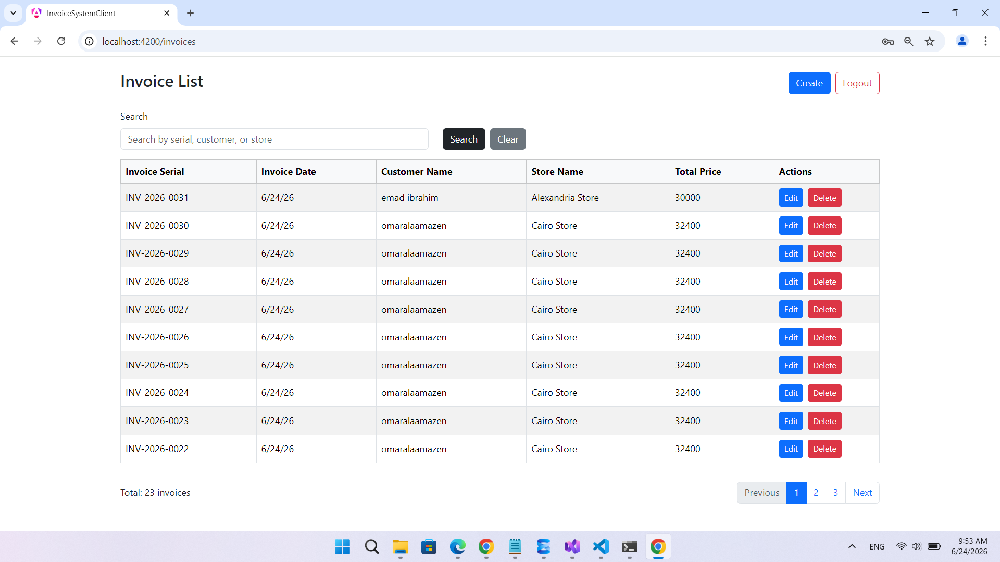
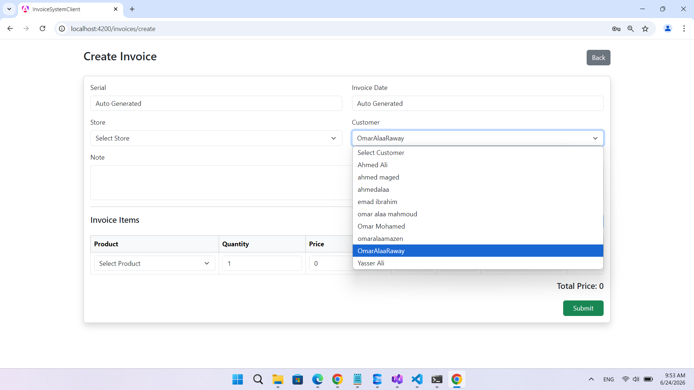
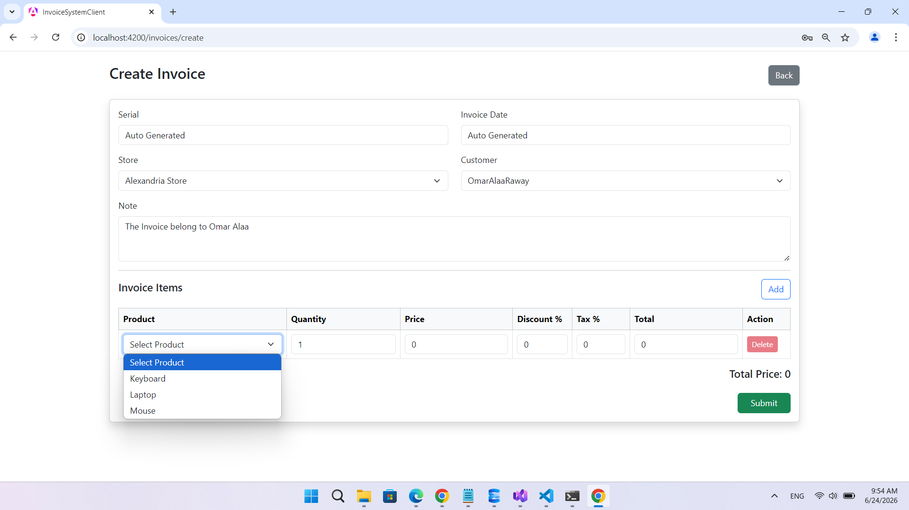
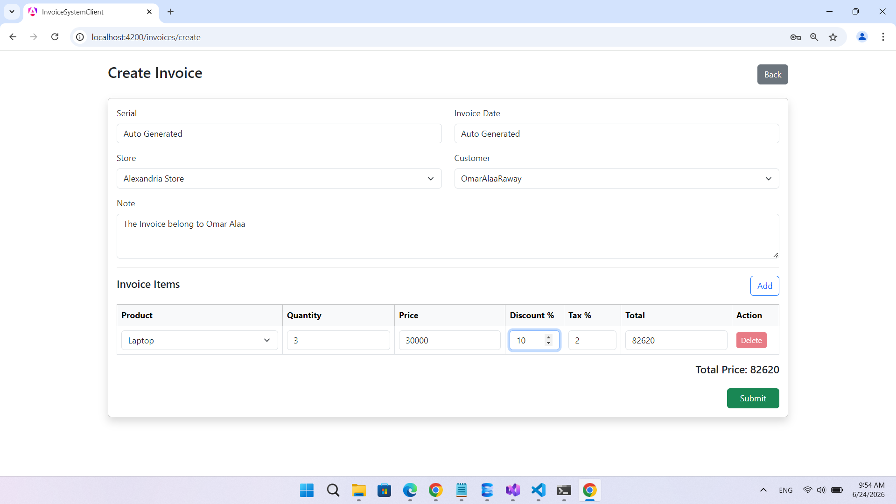

# Invoice Management System

A full-stack invoice management system built with **ASP.NET Core Web API** and **Angular**.
The system allows authenticated users to create, edit, delete, search, and view invoices with pagination and real-time invoice list refresh using **SignalR**.

## Technologies Used

### Backend

* ASP.NET Core Web API
* Entity Framework Core
* SQL Server / LocalDB
* ASP.NET Core Identity
* JWT Authentication
* AutoMapper
* FluentValidation
* SignalR
* Repository Pattern
* Service Layer
* Global Exception Handling

### Frontend

* Angular
* TypeScript
* Bootstrap
* Bootstrap Icons
* SignalR Client
* Angular Routing
* HTTP Interceptor
* Auth Guard

## Features

* User Register
* User Login with JWT Token
* Protected Routes using Auth Guard
* Automatic Token Injection using HTTP Interceptor
* Create Invoice
* Edit Invoice
* Delete Invoice
* Get Invoice by Id
* Invoice List ordered by descending date
* Search invoices by serial, customer name, or store name
* Pagination for invoice list
* Real-time invoice list refresh using SignalR
* Product dropdown with automatic price display
* Backend calculates invoice item total and invoice total price
* Global error response handling


## Screenshots

### Login Page


### Register Page


### Invoice List


### Invoice List with Pagination


### Create Invoice - Select Customer


### Create Invoice - Select Product


### Create Invoice - Total Calculation



## Project Structure

```text
InvoiceSystem
│
├── InvoiceSystem.API
│   ├── Controllers
│   ├── Data
│   ├── Dtos
│   │   ├── Request
│   │   └── Response
│   ├── Hubs
│   ├── MappingProfile
│   ├── Models
│   ├── Repositories
│   ├── Services
│   ├── Validation
│   └── Helpers
│
└── invoice-system-client
    ├── src
    │   ├── app
    │   │   ├── auth
    │   │   ├── core
    │   │   │   ├── guards
    │   │   │   ├── interceptors
    │   │   │   └── services
    │   │   ├── invoices
    │   │   └── models
    │   └── environments
```

## Backend Architecture

The backend follows a clean layered structure:

```text
Controller
↓
DTO Mapping
↓
Service Layer
↓
Repository Layer
↓
Database
```

### Controller Responsibilities

* Receive request DTOs
* Map DTOs to models
* Call service methods
* Return response DTOs

### Service Responsibilities

* Business logic
* Invoice calculations
* Validation of business rules
* Generate invoice serial
* Handle SignalR notifications

### Repository Responsibilities

* Database access
* Add, update, delete, and query data
* Include related entities when needed

## Authentication Flow

1. User registers using email, password, and full name.
2. After register, the user must login.
3. Login returns a JWT token.
4. Angular stores the token in localStorage.
5. Angular interceptor sends the token with protected API requests.
6. Auth Guard prevents unauthenticated users from accessing invoice pages.

## Invoice Calculation

The frontend displays item price when a product is selected.
However, the frontend does not send the price to the backend.

The backend gets the real product price from the database and calculates:

```text
Subtotal = Quantity * Price
Discount Value = Subtotal * Discount Percentage / 100
After Discount = Subtotal - Discount Value
Tax Value = After Discount * Tax Percentage / 100
Total = After Discount + Tax Value
```

This protects the system from price manipulation from the frontend.

## SignalR

SignalR is used to refresh the invoice list in real time.

When an invoice is created, updated, or deleted, the backend sends an event:

```text
InvoicesUpdated
```

The Angular frontend listens to this event and reloads the invoice list automatically.

## Main API Endpoints

### Auth

```http
POST /api/auth/register
POST /api/auth/login
```

### Products

```http
GET /api/products
```

### Stores

```http
GET /api/stores
```

### Customers

```http
GET /api/customers
```

### Invoices

```http
GET /api/invoices?pageNumber=1&pageSize=10&search=
GET /api/invoices/{id}
POST /api/invoices
PUT /api/invoices/{id}
DELETE /api/invoices/{id}
```

## How to Run the Backend

1. Open `InvoiceSystem.API` in Visual Studio.
2. Check the connection string in `appsettings.json`.
3. Open Package Manager Console.
4. Run migrations if needed:

```powershell
Update-Database
```

5. Start the API project.
6. Swagger should open at:

```text
https://localhost:PORT/swagger
```

## How to Run the Frontend

1. Open `invoice-system-client` in VS Code.
2. Install dependencies:

```powershell
npm install
```

3. Check the backend URL in:

```text
src/environments/environment.ts
```

Example:

```ts
export const environment = {
  production: false,
  apiUrl: 'https://localhost:7172/api',
  hubUrl: 'https://localhost:7172/hubs/invoices'
};
```

4. Run Angular:

```powershell
ng serve --open
```

5. The frontend will run at:

```text
http://localhost:4200
```

## Important Notes

* The backend must be running before using the Angular frontend.
* The Angular `apiUrl` and `hubUrl` must match the backend port.
* The invoice list is ordered by descending date.
* The customer does not create invoices. The authenticated system user creates invoices for selected customers.
* The product price is displayed in Angular but calculated securely from the backend.

## Test Scenario

1. Register a new user.
2. Login with the user account.
3. Open the invoice list.
4. Create a new invoice.
5. Select store, customer, and products.
6. Check that product price appears automatically.
7. Submit the invoice.
8. Confirm that the invoice appears in the list.
9. Test search.
10. Test pagination.
11. Edit an invoice.
12. Delete an invoice.
13. Open the invoice list in two browser tabs and test SignalR real-time refresh.

## Project Status

The project is completed with:

* Backend API
* Angular frontend
* Authentication
* Invoice CRUD
* Search
* Pagination
* SignalR real-time refresh
* DTOs
* AutoMapper
* Validation
* Global exception handling
